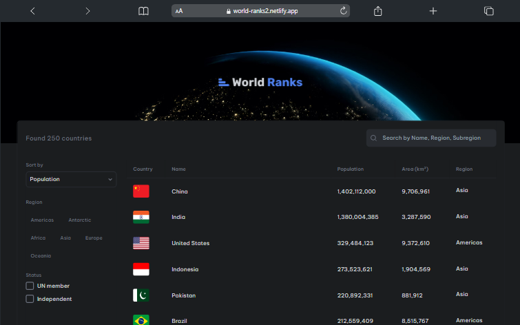

# 🌎 World ranks

## 💻 Deploy

<a href="https://world-ranks2.netlify.app/">Clique aqui para ver o projeto</a>

## 📝 Descrição

Este aplicativo da web exibe informações detalhadas sobre países ao redor do mundo usando dados da API REST Países. O aplicativo é composto por diversas seções e componentes interativos que permitem aos usuários pesquisar, filtrar e classificar informações sobre os países.

Principais recursos: Pesquisa e filtro:

Pesquisa por nome ou região: os usuários podem digitar no campo de pesquisa para filtrar países por nome ou região. Filtrar por Região: Um filtro permite selecionar uma ou mais regiões específicas (como África, Américas, Ásia, Europa, etc.). Filtro de Membros da ONU: Uma opção para filtrar países que são membros da ONU. Filtro de Independência: Uma opção para filtrar países que são independentes. Ordenação:

Classificar por população: os países podem ser classificados em ordem decrescente de população. Classificar por área: os países podem ser classificados em ordem decrescente de área. Classificar por nome: os países podem ser classificados em ordem alfabética por nome comum. Exibição de dados:

Seção Hero: Uma seção principal de destaque na interface do usuário. Tabela: Exibe os dados do país em formato tabular, mostrando informações filtradas e classificadas de acordo com as preferências do usuário. Indicador de carregamento: mostra um indicador de carregamento enquanto os dados estão sendo buscados e processados. Fluxo de dados: Estado inicial:

O aplicativo começa com estados iniciais de pesquisa vazios, opção de classificação populacional e nenhum filtro de região, membro da ONU ou independência aplicado. Busca de dados:

Os dados são obtidos da API REST Countries quando o componente é montado e quando há alterações nos filtros. Filtragem e classificação:

Os dados são filtrados e classificados de acordo com as seleções do usuário na região, membro da ONU, filtros de independência e opções de classificação.

Este aplicativo é ideal para quem precisa de uma ferramenta interativa e fácil de usar para explorar e comparar informações sobre países do mundo todo.

## 🔧 Instalação

Instalação com npm

```bash
  git clone "https://github.com/rogervalentim/world-ranks.git"
  cd country
  npm install
```

## 🔌 Como Rodar

```bash
  npm run dev
```

## 📊 Tecnologias e libs utilizadas

<ul>
<li>React</li>
<li>Tailwind Css</li>
<li>Typescript</li>
</ul>

## 📸 Imagem do projeto


